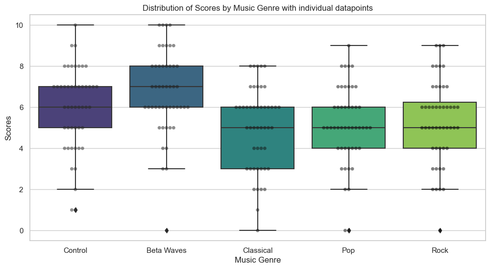
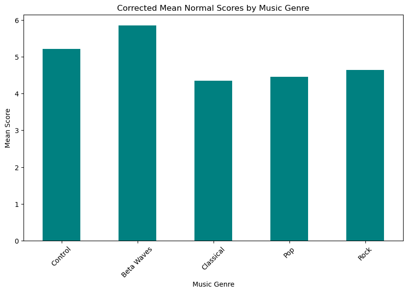
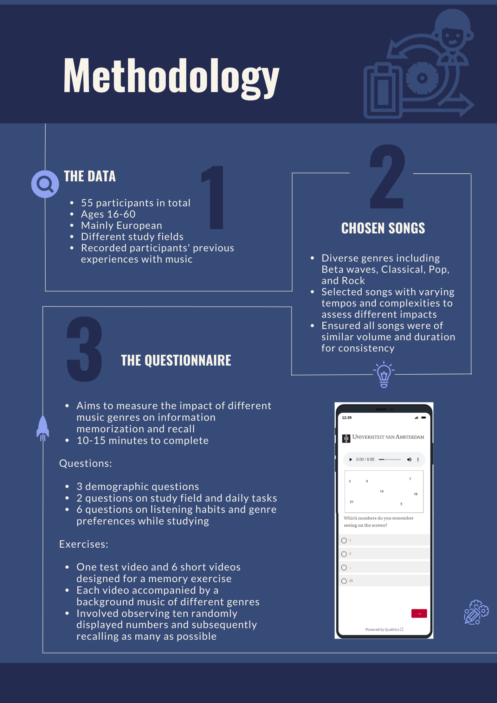
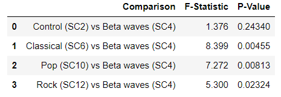

```{r setup, include=FALSE}
library(flexdashboard)
library(ggplot2)
library(ggExtra)
library(hrbrthemes)
library("readxl")
HpResults <- read_excel("HpResults.xlsx")
```

Introduction
=======================================================================


Column {.tabset}
-----------------------------------------------------------------------

### Introduction

Over the last decade we have seen a surge of different study music playlists on popular platforms like Youtube or Spotify. These playlists often include more low-tempo genres such as, jazz, lofi, classical, or no melody music such as beta-waves or white noise. Similarly, the University of Amsterdam has collaborated with Het Concertgebouw (Amsterdam Concert Hall) to provide study sessions while a classical pianist is playing in the background (Concertgebouw 2022). Thus, different genres are being marketed as more suitable for studying purposes. The Concertgebouw even markets their study sessions with the claim that classical music does, in fact, make you more productive (Concertgebouw 2022).
 
In our research we wanted to test for ourselves whether the genres marketed as study genres actually aid people in recalling information. This is why we have set up an experiment in which we test how well the respondents memorize strings of numbers while listening to four different genres of music: rock, pop, classical, and beta-waves. By doing this we can find out how well the music that is marketed as enhancing study performance actually works. 

In the subsequent pages, we will delve into the conclusions drawn from our study, discuss the unexpected outcomes, and provide insights into the implications of our findings on the broader understanding of music's impact on cognitive processes. Moreover, we will explore the limitations of our study, shedding light on potential confounding variables that may have influenced participant performance.


### Experimental Design

The experimental design involved the presentation of ten numbers ranging from 1 to 20 on a white screen, each displayed with a 2-second interval for a duration of 3 seconds. This scenario was replicated across five conditions: a control group with no music and four experimental groups exposed to pop, classical, rock, and beta waves during the numerical presentation. The objective was to examine how different music genres, each with its distinct auditory characteristics, influenced the participants' ability to recall and memorize the numerical sequences.


### Boxplot & Bar Chart

The chart representing the mean scores across all test conditions reveals compelling insights into the impact of music genres on recalling numerical values. Notably, the highest mean score was observed in the beta waves group, followed closely by the control group with no music. Surprisingly, rock music secured the third-highest mean score, contrasting expectations given its often intense characteristics. Pop music followed in fourth place, while classical, typically associated with calming tones, landed in the last position.

We will investigate whether the calming nature of beta waves indeed leads to enhanced recall, as suggested by the higher mean score in that group. To comprehensively understand the significance of our findings, two ANOVA analyses will be carried out. This statistical approach will help us discern if the observed differences in mean scores among the various music genres are statistically significant. The preliminary examination of the results suggests potential significance for beta waves, and rock music compared to the control group, while classical and pop music show trends that require a deeper statistical exploration.


Column {data-width=1550, .tabset}
-----------------------------------------------------------------------

### Boxplot

<div>
  
</div>

### Bar Chart
<div>
  
</div>


Column {data-width=550}
-----------------------------------------------------------------------

### Motivation

<b>Adel</b>

I often listen to music while studying and have always wondered whether I can utilize different genres and types of music to speed up the process of memorizing new information and help me study better. I'm curious about whether a catchy tune or a relaxing melody can actually make a difference in how we learn and recall information. Our study is all about finding out how the music we listen to can shape the way our brains work when we're trying to remember and recall information. It's a mix of my love for music and a natural curiosity about how it impacts our minds in daily life.

<b>Ana-Maria</b>

In elementary school, my teacher used to play us Bach and Mozart during different classes as math, art, or literature. She used to tell us that classical music can help us learn better and that other genres, like rock or pop, are not welcomed in our study routines. Growing up, I noticed that rock music went hand in hand with math, pop with programing and classical with reading and that other genres could help me have better performance while learning depending on my music preference in that certain moment. The fact that I could study well when listening to other genres, made me question my teacher’s belief. In this project, I have the opportunity to see if listening to classical music while studying is really beneficial and if there are other genres that can facilitate better results when it comes to memory stimulation in studying.

<b>Aron</b>

My motivation for conducting an experiment on how different music affects a person's ability to recall information stems from my personal experience as a student. I have noticed a distinct difference in my studying habits when it comes to various subjects. Specifically, I find that I can focus well on mathematics and statistics when accompanied by music, as it seems to enhance my engagement with the material.

On the contrary, when delving into economic methodology, a more philosophical and abstract subject, I find that I prefer complete silence or the subtle background of beta waves. This discrepancy in my preferred study environments for different subjects has sparked my curiosity about the potential impact of music on cognitive functions, particularly memory and recall.


<b>Nienke</b>

Music is an integral part of my life. My father is a jazz musician and my mom plays the cello and works for the classical music radio. Naturally, from a young age I have been exposed to different genres of music and music theory. Because of this, I have started listening to music during almost every task imaginable, including studying. Background music has often made tasks easier to complete, but it has also interrupted my studying or my ability to memorize information. By doing this research I am hoping to find out whether studying results might be enhanced by music, and if so whether different genres could produce different results. Maybe after this research I can use music in a way that makes my studying process more efficient.


Methodology
=======================================================================


Column {data-width=550}
-----------------------------------------------------------------------


### Participants  {.no-padding}
```{r}
valueBox (48, icon ="ion-ios-person", color = "#80ffff")
```

### Genres  {.no-padding}
```{r}
valueBox (4, icon ="ion-music-note", color = "lightblue")
```

### Questions  {.no-padding}
```{r}
valueBox (15, icon ="ion-android-search", color = "#b3b3ff")
```

### Videos  {.no-padding}
```{r}
valueBox (7, icon ="ion-android-film", color = "#6666ff")
```

Column {data-width=1350}
-----------------------------------------------------------------------

### 
<div>
  

</div>

```{r}

```


Column {data-width = 10}
-----------------------------------------------------------------------

### Beta Waves Survey Video

<video height = "100" width = "250" controls>
  <source src="Honours 3 beta waves.mp4" type="video/mp4">
</video> 

### Classical Music Audio

<audio controls>
  <source src="Honours 4 classical.mp4" type="audio/mpeg">
</audio> 

### Pop Music Audio 

<audio controls>
  <source src="Honours 6 pop.mp4" type="audio/mpeg">
</audio> 

### Rock Music Audio

<audio controls>
  <source src="Honours 7 rock.mp4" type="audio/mpeg">
</audio> 


Charts {data-navmenu="Research" data-orientation=columns}
=======================================================================

Column {.tabset}
-----------------------------------------------------------------------

### <font color="#000000">Control</font> 

```{r}
  p = ggplot(HpResults, aes(SC2, SC3)) + geom_point( color="black",
        fill="#8080ff",
        shape=21,
        alpha=0.5,
        size=6,
        stroke = 1) + theme_ipsum()
  ggMarginal(p, type="histogram")
```


### <font color="#`000000">Beta Waves</font> 
```{r}
  p = ggplot(HpResults, aes(SC4, SC5)) + geom_point(color="black",
        fill="#66ffc2",
        shape=21,
        alpha=0.5,
        size=6,
        stroke = 1) + theme_ipsum()
  ggMarginal(p, type="histogram")
```

### <font color="#`000000">Classical Music</font>

```{r}
  p = ggplot(HpResults, aes(SC6, SC7)) + geom_point(color="black",
        fill="darkblue",
        shape=21,
        alpha=0.5,
        size=6,
        stroke = 1) + theme_ipsum()
  ggMarginal(p, type="histogram")
  
```


### <font color="#`000000">Pop Music</font> 
```{r}
  p = ggplot(HpResults, aes(SC10, SC11)) + geom_point(color="black",
        fill="#dd99ff",
        shape=21,
        alpha=0.5,
        size=6,
        stroke = 1) + theme_ipsum()
  ggMarginal(p, type="histogram")
```

### <font color="#`000000">Rock Music</font> 
```{r}
  p = ggplot(HpResults, aes(SC12, SC13)) + geom_point(color="black",
        fill="#ff4d4d",
        shape=21,
        alpha=0.5,
        size=6,
        stroke = 1) + theme_ipsum()
  ggMarginal(p, type="histogram")
```


Column {.tabset}
-----------------------------------------------------------------------

### <font color="#000000">Control</font> 

```{r}
par(mfrow =c(1,2))
hist(HpResults$SC2, main = "Correct Answers", xlab = "Number of Correct Answers", col = "#8080ff")
hist(HpResults$SC3, main = "Wrong Answers", xlab = "Number of Wrong Answers", col = "#99bbff")
```


### <font color="#`000000">Beta Waves</font> 
```{r}
  par(mfrow =c(1,2))
hist(HpResults$SC4, main = "Correct Answers", xlab = "Number of Correct Answers", col = "#66ffc2")
hist(HpResults$SC5, main = "Wrong Answers", xlab = "Number of Wrong Answers", col = "#80ff80")
```

### <font color="#`000000">Classical Music</font>

```{r}
  par(mfrow =c(1,2))
hist(HpResults$SC6, main = "Correct Answers", xlab = "Number of Correct Answers", col = "darkblue")
hist(HpResults$SC7, main = "Wrong Answers", xlab = "Number of Wrong Answers", col="lightblue")
```


### <font color="#`000000">Pop Music</font> 
```{r}
par(mfrow =c(1,2))
hist(HpResults$SC10, main = "Correct Answers", xlab = "Number of Correct Answers", col = "#dd99ff")
hist(HpResults$SC11, main = "Wrong Answers", xlab = "Number of Wrong Answers", col = "#ecb3ff")
```

### <font color="#`000000">Rock Music</font> 
```{r}
  par(mfrow =c(1,2))
hist(HpResults$SC12, main = "Correct Answers", xlab = "Number of Correct Answers", col = "#ff4d4d")
hist(HpResults$SC13, main = "Wrong Answers", xlab = "Number of Wrong Answers", col = "#ff5c33")
```


### <font color="#`000000">Age</font> 

<div>
  
</div>


### <font color="#`000000">Tasks</font> 

<div>
  
</div>

### <font color="#`000000">Study</font> 

<div>
  
</div>

### <font color="#`000000">Significance</font> 

<div>
  
</div>

Column {.tabset}
----------------------------------------------------------------------------------

### Music Charts Description

<b>Control</b>

Control cathegory re

### Other Variables


ANOVA {data-navmenu="Research" data-orientation=columns}
=======================================================================

Column
------------------------------------------------------------------

### Description

<b>Table Control Interpretation</b>

For Beta waves vs Control: The p-value is higher than 0.05, indicating no statistically significant difference. 

For Classical vs Control and Pop vs Control: The p-values are lower than 0.05, suggesting statistically significant differences in scores when compared to the control group.

For Rock vs Control: The p-value is close to 0.05, indicating a trend towards significance, but it's not conclusively significant at the standard 0.05 level. 

Therefore, based on this analysis, the genres "Classical" and "Pop" show statistically significant differences in scores compared to the control group, whereas "Beta waves" and "Rock" do not demonstrate statistically significant differences at the conventional 0.05 level.

<b>Table Beta Waves Interpretation</b>

For Control vs Beta waves: The p-value is higher than 0.05, suggesting no statistically significant difference.

For Classical vs Beta waves, Pop vs Beta waves, and Rock vs Beta waves: The p-values are lower than 0.05, indicating statistically significant differences in scores when compared to the Beta waves group.

Thus, in this analysis, the genres "Classical", "Pop", and "Rock" show statistically significant differences in scores compared to the Beta waves group.


Column
----------------------------------------------------------------------

### Table Control


### Table Beta Waves




Conclusion
=======================================================================


Column {data-width=650}
-----------------------------------------------------------------------

### Conclusion & Discussion

The results from our experiment show that overall the respondents memorized the most numbers while listening to beta waves. The second best performance was observed during the control video with no music. These results are however both close to each other and show that whether one listens to beta waves or no music does not make a significant difference when it comes to the ability to recall or memorize strings of numbers. Our initial hypothesis was that respondents would recall most numbers while listening to no music, and recall a bit less while listening to beta waves. In other words, we thought that any kind of background noise would disrupt the ability to retain information. Although the results of the beta waves experiment compared to the control group with no music were not deemed significant based on the ANOVA tests, one can observe in the bar graph that while listening to beta waves, participants had a higher average score of about 5.9 compared to 5.2 for the no music experiment. Thus, the hypothesis that respondents would do better while listening to no music than while listening to beta waves seems to be incorrect, although we can not make a conclusive statement due to the high p-value of the ANOVA test. Therefore, we want to highlight that further research is needed to support our findings and to be able to generalize and conclude that beta waves indeed have a positive effect on cognitive functions. 

Additionally, we hypothesized that while listening to music with more melody, a faster tempo and more lyrics, participants were going to perform worse than by listening to music with no melody or lyrics (beta waves). Therefore, we expected them to score lower with rock and pop music playing in the background. The results indicate that this is indeed the case, as the ANOVA tests show a significant difference when comparing the beta waves experiment to rock and pop music, with p-values well below the significance level of 0.05. However, the respondents performed significantly worse not only while listening to rock and pop music, but also with classical music playing in the background, with the average scores for these genres being close to four correct answers. This went against our initial hypothesis that a faster tempo and more lyrics would be the main source of distraction. Before conducting the experiment, we believed that we would see a better performance while listening to classical music compared to rock or pop. Instead we found that every type of melodic music used in our experiment roughly produced the same results, and decreased the ability to recall strings of numbers. 

To conclude, the presence of melody or lyrics on their own do not cause a difference in the ability to recall information. It is rather the two of them combined that worsen the performance of people when it comes to studying. Thus, people do better trying to recall information while listening to a constant, non-changing background noise, such as beta waves. No background music worsens the performance, but only by a slight amount. It is also important to note various other variables that might have caused people to perform worse or better than others, such as age, study field or the part music plays in someone's life. Respondents under the age of 18 scored overall 1 to 1,5 points higher than other age groups. Respondents in humanities scored highest out of all the different scientific fields, and people that considered music to be a big part of their lives scored roughly half a point higher than those who do not. Although these variables need to be mentioned it might as well be that the difference in these is mainly caused by our low sample size of 48 usable results, and an even lower number of participants for each category. For example, if we have had only two to three respondents under the age of 18 years old, and they performed well on the task, this could have skewed our results and misled us to the wrong conclusions. Thus, we want to highlight that the generalizability of our findings is limited due to our relatively small sample size, but we still hope that our results provide a fresh and novel perspective on the relationship between background music and memory.


Column
----------------------------------------------------------------------

### Limitation

In the classical music video two numbers were unintentionally repeated twice which could confuse participant and impact their scores for this exercise.

The questionnaire was quite long so some people could have lost focus towards the end.

In one of the videos there was a pattern that revealed itself after a couple of videos. Several numbers were paired up (5,6,8,9 etc.). This could have caused respondents to perform better during this video. 

As the videos had the same structure, the participants could make strategies like keeping in mind lists of prime numbers' multiples, in order to remember more numbers in the following videos. This fact could reduce the importance of the background music and focus more on the performance of the strategy.

### Background

<b>Shih, Y.N., Huang, R.H. and Chiang, H.Y. (2012). “Background music: Effects on attention performance”, Work, 42(2): 573-578.</b>

This research found that people score significantly worse in concentration and attention tests when they listen to background music with lyrics, as compared to when they listen to background music without lyrics. This is in line with a previous theory which states that more complex stimuli influence the behavior of people more extensively. In this case the lyrics add onto the complexity of the stimulus, and thus there is a greater negative effect on the participants. 

<b>Huang, R.H. and Shih, Y.N. (2011). “Effects of background music on concentration of workers”, Work, 38(4): 383-387.</b>

When people listen to music their concentration is largely affected by how much they like the background music, and not so much by the type of music. When the researchers compare this with no background music, the participants score significantly better on the attention tests when they like the music. 

<b>Flores, D.R.A. (2021). “The effects of music genre on scores in different exam types: A pilot study”, Kwantlen Psychology Student Journal, (3): 86-97.</b>

This research found that there seems to be no difference in study performance and reading comprehension when people listen to either Lo-Fi music, Classical music, or no music. Thus, whether someone listens to background music - specifically Lofi or Classical - or no background music while studying should not affect their study performance differently. 

<b>Madjar, N., Gazoli, R., Manor, I. and Shoval, G. (2020). “Contrasting effects of music on reading comprehension in preadolescents with and without ADHD”, Psychiatry Research, 291.</b>

Madjar et al. found in their study that people with ADHD performed significantly better on a reading comprehension test when listening to background music, whereas respondents without ADHD performed worse. 

<b>Mensink, M.C. and Dodge, L. (2014). “Music and memory: Effects of listening to music while studying in college students”, Journal of Student Research: 203-215.</b>

Mensink and Dodge found that their respondents produced better memorization results while working with no music in comparison to working with music. However, contrary to popular belief they found that the students they tested were able to recall more information after listening to pop music than classical music. 

<b>Söderlund, G.B., Sikström, S., Loftesnes, J.M. and Sonuga-Barke, E.J. (2010). “The effects of background white noise on memory performance in inattentive school children”, Behavioral and brain functions, 6(1): 1-10.</b>

Children with ADHD react better to white noise than children without ADHD. In the experiment conducted by the authors of this paper, the researchers found that overall children with attention problems benefitted from a constant background noise and obtained higher scores on a memorization test than attentive children. For children without ADHD, the background noise lowered their scores. 

<b>Concertgebouw (2022). “Entrée Study Sessions: studeren en werken met live-muziek”, https://www.concertgebouw.nl/concerten/2374122-entr%C3%A9e-study-sessions-studeren-en-werken-met-live-muziek, Consulted on January 14 2024.</b>

This link shows one of the previous study-concerts held by Het Concertgebouw in Amsterdam, as mentioned in the introduction. The Concert Hall markets their concert by stating that classical music makes you more productive, as read in the following translated citation: “Did you know that classical music seems to make you more productive? Come and experience it for yourself!” 


Adel's literature review {data-navmenu="Article Review" data-orientation=columns}
=======================================================================
Introduction

In an era where multitasking with music is becoming increasingly popular, the article "Do you listen to music while studying? A portrait of how people use music to optimize their cognitive performance" by Goltz and Sadakata offers crucial insights. Their research explores how individual preferences and methods for background music (BGM) affect cognitive function when performing tasks including writing, reading, and memorization. The results show a variety of individual BGM use techniques as well as general trends such as a negative connection between BGM frequency and age and a decreased use of BGM in challenging activities. Understanding these inclinations could provide valuable strategies for improving studying and cognitive function in today's digitally-driven environment. This article review provides a summary and a comprehensive evaluation of the work of Goltz and Sadakata and thereby explores the intriguing relationships between music and cognitive behavior. 

Summary

The paper is divided into various sections and begins with an overview of past studies on the topic, which sets the context for the authors' investigation. Goltz and Sadakata analyze several previous studies on the effects of BGM on reading, memory, critical thinking and reasoning, writing, and attention. The findings are mixed: while some studies report detrimental effects of music with lyrics on reading and critical reasoning, others show no effect or even positive outcomes. The variability in results points out the complexity of the relationship between background music, task type, and individual differences. Thus, the authors highlight the need for further research to unravel these intricate interactions. After reviewing substantial previous literature, the article continues to describe in detail the authors’ own experiment. Their approach consists of an online survey with 140 participants designed to collect a varied range of experiences with background music consumption during cognitive processes such as reading, writing, and memorizing. The study is empirical, relying on self-reported data to understand individual preferences and strategies in using music. In the “Results” and “Discussion” sections Goltz and Sadakata investigate the relationships between background music consumption and a variety of variables, including age, task complexity, musical background, and personality traits such as extraversion. One of the article's core points is that people's use of background music varies depending on their task complexity and different individual characteristics. Among others, the study finds that younger people are more inclined to use background music, and there's a tendency to choose less music or less specific types of music for more difficult activities. The work positions itself within the broader field of cognitive and educational psychology, contributing to continuing discussions about the importance of different environmental influences in cognitive performance. Instead of making concrete statements, the authors propose a more moderate viewpoint that acknowledges the complexities of the relationship between music and cognition.

Evaluation

In terms of theoretical background, the article does a commendable job of situating itself within the exsisting literature, with summarizing and contextualizing the results of more than fifty previous studies. The authors acknowledge the varying results of studies and attempt to offer a more nuanced understanding of the subject. While this approach is comprehensive,  it also implies a certain level of inconclusiveness, potentially leaving the reader without a clear direction or conclusion. A more critical perspective on the previous literature, such as taking a stand or proposing a new theoretical framework, might have provided more depth and clarity to the article. Goltz and Sadakata’s neutral stance, although academically safe, could be seen as a missed opportunity to advance the discourse in a more decisive direction. The article becomes repetitious in its assertion that the different past studies present mixed and sometimes contradictory findings. There are areas where the discussion could have been deepened or expanded, for instance regarding the psychological mechanisms underlying the observed effects of background music. The analysis intends to be comprehensive but falls a bit short in addressing the complex interplay of personal preference, task nature, and music type. 

Regarding the authors' own experiment, while the survey-based methodology allows for a broad understanding of music usage among different demographics, it relies heavily on self-reported data which might not accurately reflect actual behavior. This reliance on subjective reporting could introduce several biases or inaccuracies, as participants' responses may not always reflect their actual behaviors or experiences accurately. Additionally, the demographic skew towards younger participants, as well as the relatively small sample size significantly limits the generalizability of the findings. A more diverse age range could have offered a broader understanding of the effects of music across different stages of life. Furthermore, the study does not explore the perspective that next to the different genres and types of music, factors such as music tempo, lyrics or music sentiment can all play a substantial role in music listening patterns and preferences, and perhaps even have the power to significantly influence the study’s conclusions. 

While there are certainly some areas of improvement, the article also highlights some intriguing and valuable results regarding the relationship between background music and task difficulty, that make it a significant addition to the ongoing conversation about music and cognitive performance. They find that as tasks become more challenging, people tend to use BGM less frequently. Additionally, preferences shift towards genres like classical, calm, and non-vocal music for difficult tasks, while easier tasks elicit less selective BGM choices. This aligns with prior research which indeed suggests that instrumental and calm music tend to impact cognitive performance and emphasizes the adaptive nature of BGM use based on task demands and difficulty. These findings are valuable as they reflect practical strategies people adopt in real-world settings, and could serve as interesting and novel information for readers who seek to experiment with listening to various types of BGM to enhance their cognitive functions. 

Conclusion

In conclusion, the article provides a valuable contribution to the field, complementing other studies and offering insights for educators, students, and anyone interested in optimizing their cognitive environments. While the study is robust in its approach, the reliance on self-reported data and the skewed age distribution of participants are noted as limitations, indicating areas for further research. Overall, although the article offers a fresh perspective to the conversation about music and cognitive performance, it falls short in offering definitive conclusions or advancing a strong theoretical position. The study's design and approach, while informative, leave room for more detailed and rigorous exploration of the subject, and thus lay the groundwork for further research in this area.


References

Goltz, F., & Sadakata, M. (2021). Do you listen to music while studying? A portrait of how people use music to optimize their cognitive performance. Acta Psychologica, 220, 103417. https://doi.org/10.1016/j.actpsy.2021.103417


Aron's literature review {data-navmenu="Article Review" data-orientation=columns}
=======================================================================

Introduction

The question of how background music affects memory, particularly in older adults, is highly relevant in today's increasingly noisy environments. It provides valuable insights into improving cognitive function and studying age-related changes in various cognitive processes. This article review delves into the study  "Turn Off the Music! Music Impairs Visual Associative Memory Performance in Older Adults" by Reaves et al., providing useful insights into how music affects cognitive processes in both young and older participants. It will critically evaluate the study's methodology, findings, and broader implications, adding to the continuing discussion about cognitive performance and environmental influences. 

Summary

Reaves et al. begin by reviewing the existing literature on the effects of background music on cognitive performance. This literature study reveals conflicting results, particularly in terms of the impact of music on different age groups. Following that, the authors describe their own experiment, which included 64 participants divided into two groups, 32 young adults and 32 elderly adults. They took memory tests, where they were asked to learn face-name pairs, in three separate auditory conditions: silence, liked music, and disliked music. The goal was to see how these diverse surroundings affected their visual associative memory performance, in order to better understand the impacts of background music on different age groups, with a special emphasis on older adults. Their key finding was that, while all age groups expected music to be a distraction, only older persons demonstrated a significant reduction in memory function when being subjected to background music. The study’s findings are consistent with the theory that older adults’ failure to inhibit processing of distracting task-irrelevant information, such as background music, contributes to their memory impairments. The type of music (liked or disliked) did not differentially affect performance in either age group. This study implies that the effect of auditory distractions on memory tasks changes with age, emphasizing the need for additional research into age-related differences in cognitive processing in various environments. 

Evaluation

The authors’ research methodology is rigorous, and their findings are supported by previous research on the topic. The data comes from a well-designed experimental study involving a diverse participant pool, which seems appropriate and sufficient. The study's findings have significant practical consequences for older persons' capacity to complete demanding activities in noisy situations. However, while the article contains useful information about the impact of background music on cognitive performance, it is necessary to note some of its shortcomings.

Although the paper presents a thought-provoking argument, its generalization is not completely persuasive. The authors argue that older persons are more susceptible to the distracting effects of music during cognitive tasks, which is supported by their empirical data. Nonetheless, the study's narrow focus on a single type of cognitive activity (visual associative memory) and its relatively small, demographically limited sample size raise concerns about its general applicability. The study only looked at the influence of background music on associative memory performance, so it's unknown whether the same effect would be shown for other sorts of cognitive tasks like reading or writing.  While the research is methodologically sound, drawing broad generalizations about the impact of music on older persons' cognitive functions appears premature. 

Furthermore, the study did not look into the effects of different types of music on cognitive performance, which could be an intriguing topic for future research. Various genres and music types may have different effects on cognitive tasks, depending on factors such as their rhythm, tempo, and sentiment. Investigating these features could provide valuable insights into more precise auditory surroundings that influence cognitive performance. This field of research could be critical in understanding the complex interaction between music and cognitive functions in a variety of circumstances; therefore, more research is required to completely understand the impact of background music on memory.

Conclusion

In conclusion, the study "Turn Off the Music! Music Impairs Visual Associative Memory Performance in Older Adults" provides valuable insights into the differential impact of background music on cognitive performance across age groups. Its findings challenge the notion of the universal benefits of music, and emphasize the need for a more nuanced understanding of the potentially distracting effect of music. However, the study leaves room for further exploration, particularly regarding the effects and influences of different music genres. Overall, the research of Reaves et al. is a significant step towards understanding the complex relationship between auditory environments and cognitive functions, especially in the context of aging.

Works Cited

Reaves, S., Graham, B. S., Grahn, J. A., Rabannifard, P., & Duarte, A. (2015). Turn Off the Music! Music Impairs Visual Associative Memory Performance in Older Adults. The Gerontologist, 56(3), 569–577. https://doi.org/10.1093/geront/gnu113
